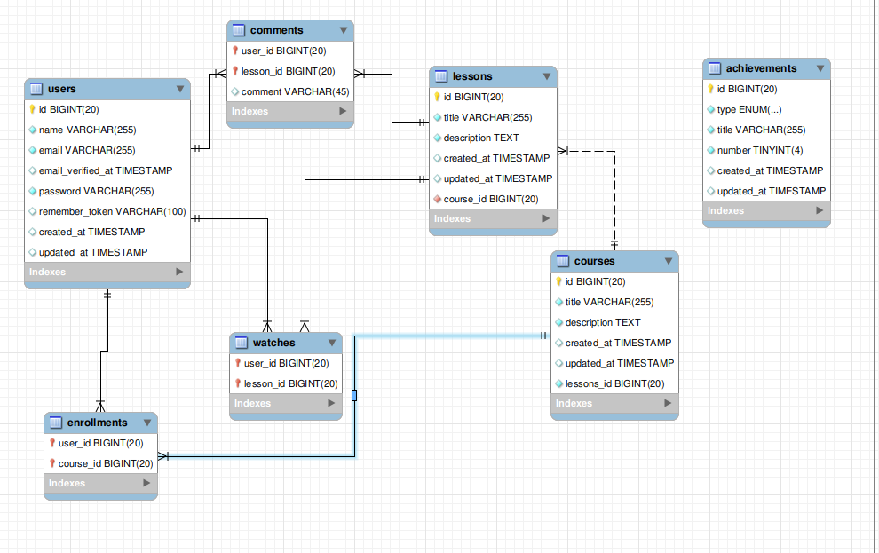

# Database Schema
(https://postimg.cc/RWBtkknz)


## Overview

comprehensive studying portal where users can enroll in lessons, complete them
to earn achievements and receive notifications via email. The system should handle
notifications asynchronously

### How to use

1. Clone the repository

```bash
git clone git@github.com:Abdelrahman-Labib/courses-sample.git
cd courses-sample
```

2. Install dependencies

```bash
composer install
```

3. Copy the `.env.example` file to `.env`

```bash
cp .env.example .env
```

4. Generate an application key

```bash
php artisan key:generate
```

5. Run migrations and seed the database (If you are using database)

```bash
php artisan migrate --seed
```

## Usage

### API Endpoints

#### Retrieve User Achievements

- **URL**

  `/api/user/:user/achievements`
- **Method**

  `GET`
- **Query Parameters**

    - `user` : User i want to retrieve his achievements
    - 
- **Example**

  `/api/user/1/achievements`

- **Response**

  ```json
  
  {
  "unlocked_achievements": [
        "First Lesson Watched",
        "First Comment Written",
        "3 Comments Written"
    ],
   "next_available_achievements": [
        "5 Lessons Watched",
        "5 Comments Written"
    ],
   "current_badge": "Beginner",
   "next_badge": "Intermediate",
   "remaining_to_unlock_next_badge": 1
  }
  ```

## Testing

To run the tests, execute the following command:

```bash
php artisan test
```


